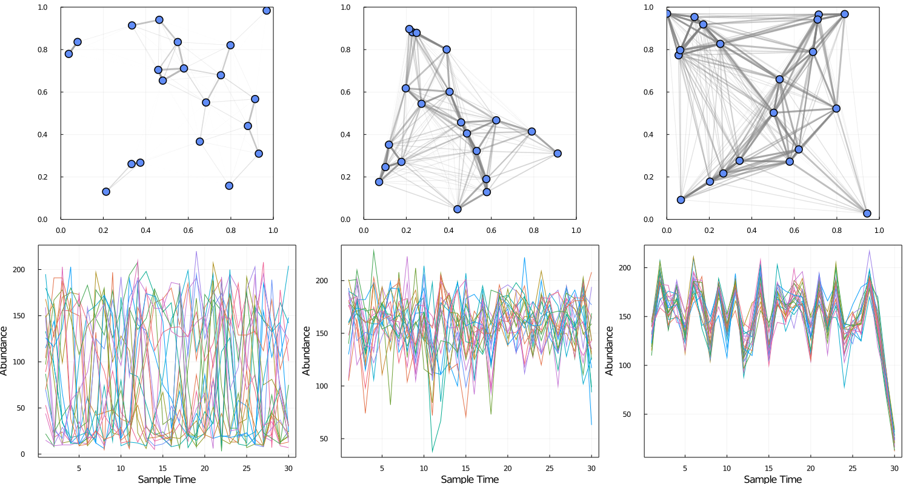
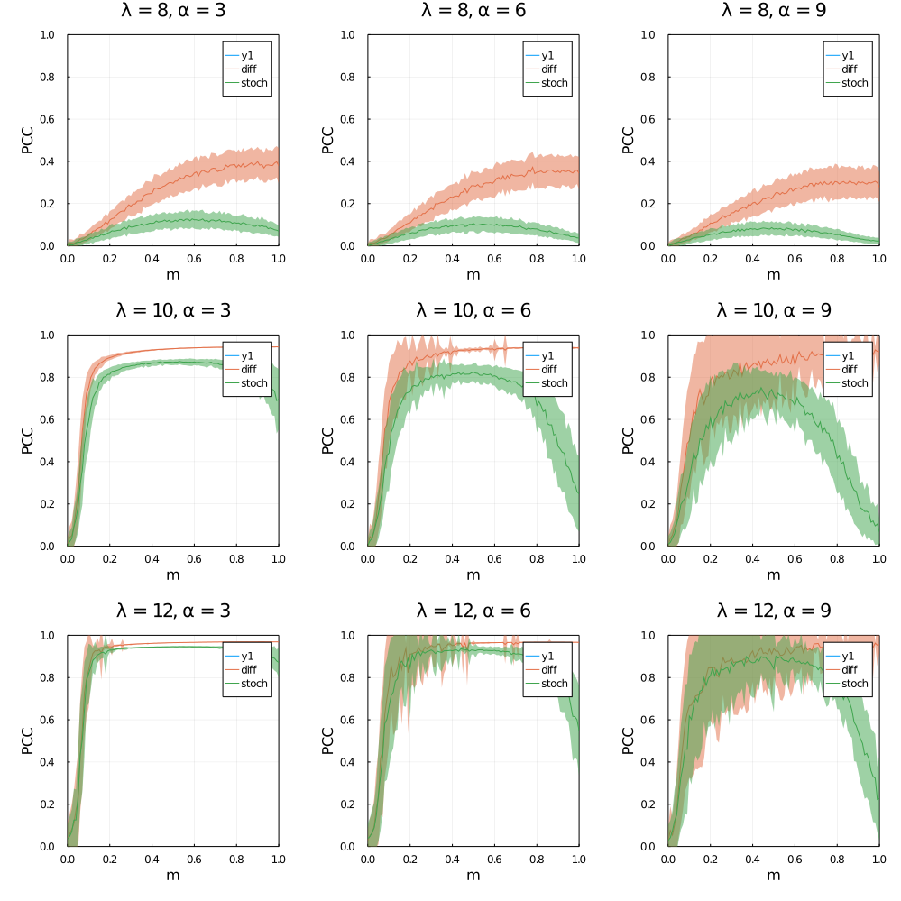
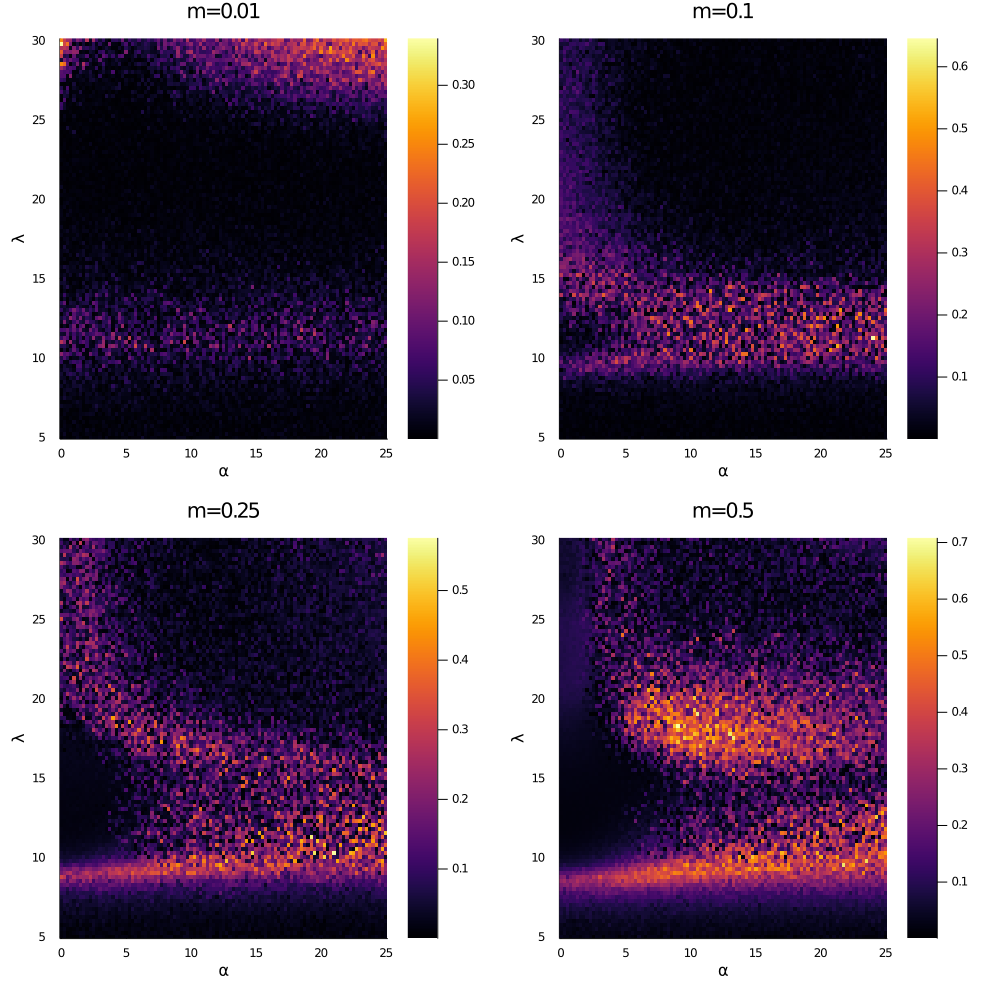
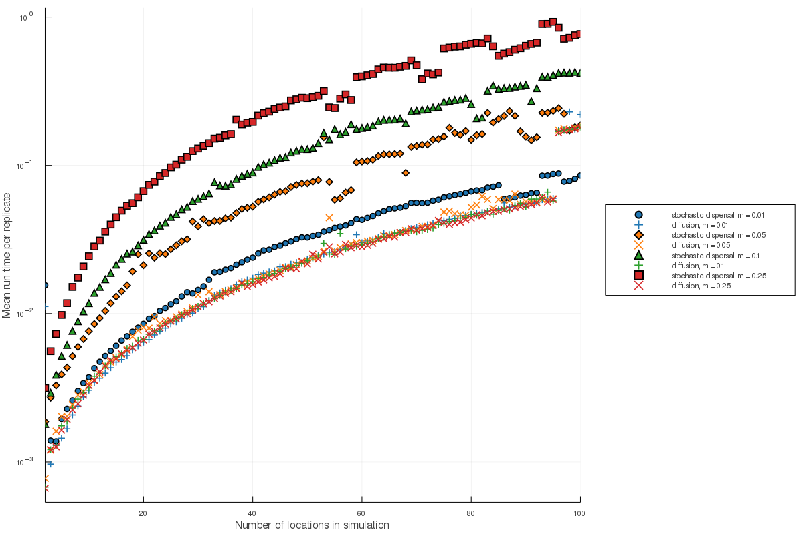

# Introduction

Human activity is changing the face of Earth, leaving landscapes that
are fragmented and patchy.

It us well understood that landscape structure influences ecosystem
processes [@cite]. Understanding how landscape structure affects
ecological processes remains a fundamental goal of ecological
research.

Landscape connectivity can mitigate the negative effects of habitat
loss on ecosystem functioning, through corridors [@Resasco2019MetDec].

 As a result understanding how habitat structure effects the movement
and dispersal of organisms, and how this scales up to explain the
abundance and distribution of species across space, is a primary aim
of landscape ecology. Models in landscape ecology---analytic,
computational, and statistical--- have long used diffusion to
approximate model how organisms move or disperse between habitat
patches [@Okubo2001DifEco; @Hastings1978GloSta].

What does it mean that model uses diffusion? The way in which
organisms move from one habitat patch to another, via active or
passive dispersal, is inherently stochastic. Diffusion approximates
this stochastic process by assuming the that stochastic process of
movement of organisms between two locations is equal to its expected
value at every time point---ignoring any temporal variation in
dispersal. However, here we show that in some cases this assumption
creates artificially synchronized dynamics across space.

Why is it important we understand when dispersal is a valid
approximation of dispersal? In order to design landscapes that
mitigate biodiversity loss and its effects [@Albert2017AppNet], we
need models to understand how landscape structure affects ecological
processes. Understanding when dispersal is well-approximated by
diffusion, and when it isn't, is important because diffusion models
are much less computationally expensive.

We do this by using a simulation model with two parts: 1) a spatial
graph model of both stochastic dispersal and diffusion, and 2) a
Ricker model of local population dynamics. We then show that there are
two regimes: one under which diffusion creates highly synchronized
dynamics where stochastic dispersal doesn't, and one under which
diffusion and stochastic dispersal produce similar distributions of
synchrony. We show that the boundaries between these regimes is caused
by both the modularity of the dispersal network and demographic
parameters. We show that what distinguishes these regimes is whether
the primary source of variation in population dynamics is either
dispersal or demography.

{#fig:example}

# Methods

Here, we present a model of metapopulation dynamics on spatial graphs.
This model contains three parts: a model of landscape connectivity, a
model of local population dynamics, and a model of dispersal. We use
this model to simulate time-series of metapopulation abundances using
both diffusion and stochastic models of dispersal, and then measure
the synchrony of population dynamics between populations. By comparing
the synchrony created by stochastic dispersal and diffusion models, we
show there are two distinct regimes: a regime where diffusion well
approximates stochastic dispersal, and a regime where it does not.

## Landscape connectivity model

Spatial graphs have long been used to model a system of habitat
patches (nodes) connected by dispersal (edges, which combined form a
landscape [@Dale2010GraSpa; @Minor2008GraFra; @Urban2001LanCon].

// have to define connectivity

To describe how the edges of this spatial graph describe dispersal,

we model landscape connectivity as a combination of two different
factors: the probability than any individual migrates during its
lifetime, $m$, and the conditional distribution over spatial nodes of
where an individual goes ($j \in L$), given both that it migrates $m$
and where it started ($i \in L$), which we call the dispersal
potential and denote

$$\Phi_{ij} =  P(i \to j | m)$$

The dispersal potential can be modeled several ways. In empirical
systems, the relative cost of movement from one point to another is
often estimated with resistance surfaces [spear_use_2010]. Here we
model the dispersal potential using isolation-by-distance (IBD), which
assumes the relative probability of dispersal from location $i$ to
location $j$ is inversely proportional to the distance between them,
$d_{ij}$, and the strength of this IBD relationship, $\alpha$, which
is treated as an intrinsic value of a species dispersal capacity. The
form of the IBD relationship (historically called the dispersal
kernel) we consider an exponential with decay-strength $\alpha$ and a
cutoff value $\epsilon$ [@Grilli2015MetPer; @Hanski1994PraMod].

$$f(d_{ij}, \alpha, \epsilon) =  \begin{cases} e^{-\alpha d_{ij}}
\quad\quad\quad &\text{if}\quad e^{-\alpha d_{ij}} > \epsilon \ \
\text{and } i \neq j \\   0 &\text{else} \end{cases}$$

Then, to construct a dispersal potential $\Phi_{ij}$ with a kernel
$f(d_{ij}, \alpha)$,  we normalize:

$$\Phi_{ij} = \frac{f(d_{ij}, \alpha, \epsilon)}{\sum_k
f(d_{ik},\alpha, \epsilon)}$$

Note that the sum of each row of $\Phi$, forms a probability
distribution, i.e. $\sum_j \Phi_{ij} = 1 \ \ \forall i$, meaning the
probability that an individual leaves its original population given
that it migrates is 1. In some cases, for a given location $i$, the
dispersal kernel $f(d_{ij}, \alpha, \epsilon)$ could be $0$ for all
$j$, in which case $\Phi_{ii}$ is set to $1$ to enforce this
condition. In all other cases, $\Phi_{ii}=0$. Also note that if
$\alpha=0$, the dispersal potential is a uniform distribution over
other locations. In Figure \ref{fig:mp}, we can see the same set of
points plotted spatial graphs plotted representing the same set of
populations across differing values of isolation-by-distance strength,
$\alpha$.

## Local population dynamics model

We model local population dynamics using the Ricker Model. At each
timestep, the abundance $N_i$ at location $i$ is drawn as

$$N_i(t+1) \sim \text{Poisson}\bigg(N_i(t) \lambda R e^{- \chi
N_i(t)}\bigg)$$

where $\chi$ represents the strength of mortality of surviving until
adulthood, $R$ is the probability that an adult reproduces ($0.9$ for
all results presented here), and where $\lambda$ is the mean number of
offspring for each individual that reproduces---yielding three total
parameters: $\theta = \{\lambda, R, \chi \}$.  We consider the
simplest variation on the model, which only includes demographic
stochasticity, however it is straightforward to extend this to other
forms of stochasticity [@Melbourne2008ExtRis].

## Dispersal Models

### Stochastic Dispersal

To simulate stochastic dispersal, the number of migrants leaving a
given location is stochasticly drawn each timestep  as  $m_{i} \sim
\text{Binomial}(N_i, m)$ for each location $i$. For every migrating
individual we randomly draw where that individual goes from the
distribution of potential destinations $\Phi^{(i)}$.

### Diffusion

To simulate diffusion dispersal, we incorporate the local Ricker Model
into a reaction-diffusion model. If the probability that an individual
disperses before reproducing is $m$, then we can define a diffusion
matrix $D$ as

$$D_{ij} = \begin{cases} \Phi_{ij}m \quad\quad\quad &\ i \neq j \\ 1-m
& i=j \end{cases}$$

where $D_{ij}$ is now the expected value an individual born in $i$
reproduces in $j$. The dispersal dynamics of the diffusion model are
described by the mapping

$$N_i(t+1) = \sum_j D_{ji} N_j(t)$$

which can be combined into the local Ricker model from above as
reaction-diffusion model by computing diffusion before each round of
local dynamics.

$$N_i(t+1) \sim \text{Poisson}\bigg( \lambda R e^{-\chi \big(\sum_j
D_{ji} N_j(t)\big)} \cdot \sum_j D_{ji} N_j(t) \bigg)$$

## Measuring Synchrony

In ecology and other fields, the crosscorrelation function, \(CC\), has long
been used as a measure of the synchrony between two time-series. Here, with a metapopulation, we consider the mean
crosscorrelation in abundances between all pairs of populations, which we call
Pairwise-Crosscorrelation ($\text{PCC}$) and compute as

$$\text{PCC}=\frac{1}{(N_p-1)^2}\sum_{i \neq j} CC(\vec{N_i},\vec{N_j})$$

where $\vec{N_i}$ is the time-series of abundances at population $i$.

# Results

We first consider how synchrony, measured by $\text{PCC}$, changes as
a function of the intrinsic dispersal probability $m$. In figure
@fig:migration_gradient, we see how $\text{PCC}$ changes in response
to $m$ at varying levels of both landscape connectivity $\alpha$ and
intrinsic growth rate $\lambda$. We see that under some combinations
of $\alpha$, $\lambda$, and $m$ both stochastic dispersal (green) and
diffusion (orange) produce similar levels of synchrony, however at
some parameter values diffusion artificially creates more synchronous
dynamics than stochastic dispersal.

{#fig:migration_gradient}

At low $\lambda$, the diffusion model produces increasingly
synchronized population dynamics as migration increases; however, the
stochastic dispersal model produces effectively no synchrony
regardless of migration rate. As $\lambda$ increases, we see two
phenomena: 1) the distribution of $\text{PCC}$ for both diffusion and
stochastic model begin to move closer to one another, and 2) the shift
from non-synchronized to synchronized dynamics becomes more
"critical", meaning it rapidly jumps to near $\text{PCC}=1.0$ as $m$
increases. As we increase $\lambda$, the gap between the diffusion and
stochastic PCC distributions shrinks.  As $\alpha$, the modularity of
the habitat networks, increases, we see the difference in PCC between
diffusion and stochastic dispersal models shrink, but the amount of
variance in this estimate increases and we increase the modularity of
the habitat network ($\alpha$). In this case, the spatial
configuration of habitat patches, and how the dispersal structure of a
randomly generated habitat network changes with $\alpha$, is driving
greater variation in the amount of synchrony observed at a given set
of parameter values.  

To better understand this, we consider "mapping" this difference in
the parameter space defined  by varying levels of landscape
connectivity $\alpha$ and intrinsic growth rate $\lambda$ at
"snapshots" of various value of intrinsic dispersal rate $m$
(@fig:lattice). Dispersal rate is often treated as a property
intrinsic to a species.

{#fig:lattice}

Why is it that we see a response to $\lambda$? Consider what we know
about the Ricker model,By comparing the synchrony created by
stochastic dispersal and diffusion models, we show there are two
distinct regimes: a regime where diffusion well approximates
stochastic dispersal, and a regime where it does not.

higher $\lambda$ without changing other parameters means the mean
population size increases. As the mean population size increases, the
size of the sampling distribution of dispersers at each timestep
increases, and we expect this distribution to converge to $\Phi$ as
the number of migrants increases toward infinity.

We conclude by emphasizing the difference in simulation time between
these models, especially as the number of spatial locations increases.
This is compounded by stochastic dispersal's runtime is sensitive to
the intrinsic migration probability $m$. At higher value of $m$, more
dispersal events occur,

{#fig:runtime}

# Discussion

When developing models to understand and predict how landscape
structure effects ecological processes, diffusion can be a convenient
abstraction to speed up computation in some cases.

Here we show that diffusion can artificially synchronize dynamics
across space.

Spatial synchrony of population dynamics is generally of interest.
Dispersal induced synchrony can increase population stability, up
until a certain threshold where the dynamics become so highly
synchronized that they increase extinction risk [@Abbott2011DisPar].

The point goes beyond synchrony. The major point we intend to make
here is that if one is developing an ecological model that involves
organisms moving across space, it is imperative to test whether
stochastic and diffusion dispersal produce similar results. Diffusion
can often be a valuable abstraction that make computation faster.
"Understanding the scope and proprer domain of each abstraction"
[@Levins1987DiaBio] One way to view this is diffusion ignores temporal
variation in dispersal.

Another important consideration for this work is what is meant by a
"location" within our model. Although we frame this in terms of
habitat patches, what an individual point in a spatial network
represents is a convenient abstract to represent the spatial dimension
of ecological processes. We argue the dispersal potential, by using
probabilistic framework to represent dispersal, is a way to describe
landscape structure at any scale.

- Spatial graph models as tool for modeling ecological processes
  across space and as generative models.
- Emergent properties and the role of stochasticity

### Acknowledgments

# References
