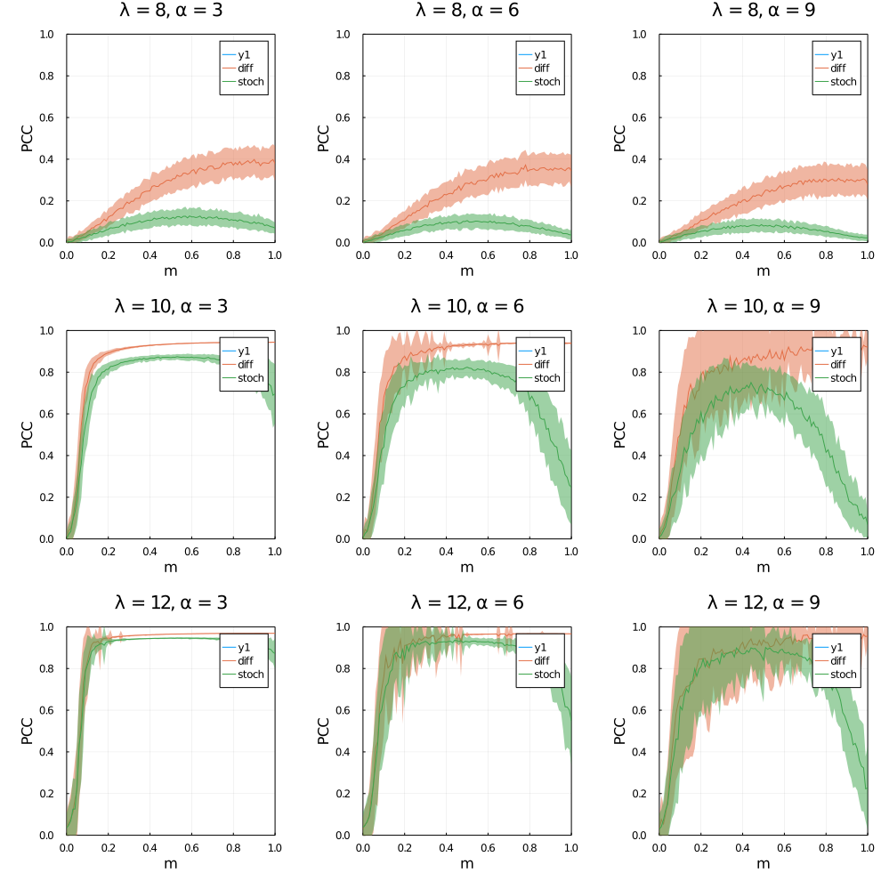
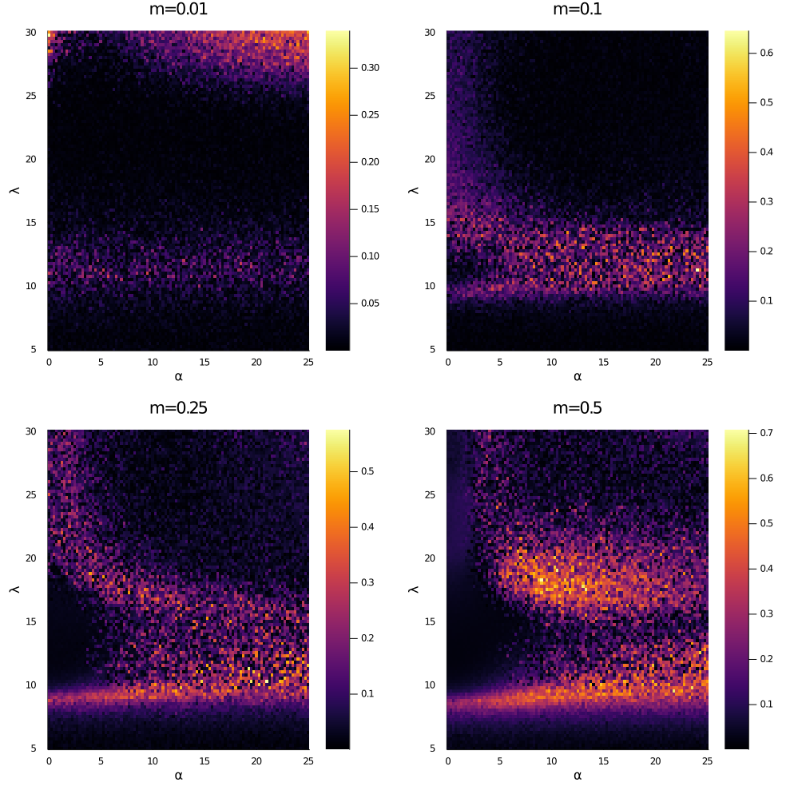

# Introduction

Human activity is leaving Earth's "natural" habitats fragmented and patchy.
Understanding how change in landscape structure affects ecological processes
remains a fundamental goal of landscape ecology. It us well understood that
landscape structure influences ecosystem processes [@cite] and that promoting
landscape connectivity can mitigate the negative effects of habitat loss on
ecosystem functioning [@Resasco2019MetDec]. As a result
understanding how habitat structure effects the movement and dispersal of
organisms, and how this scales up to explain the abundance and distribution of
species across space, is a primary aim of landscape ecology. Models in landscape
ecology---analytic, computational, and statistical--- have long used diffusion
to approximate model how organisms move or disperse between habitat patches [@Okubo2001DifEco; @Hastings1978GloSta].

What does it mean that model uses diffusion? The way in which
organisms move from one habitat patch to another, via active or passive
dispersal, is inherently stochastic. Diffusion approximates this stochastic
process by assuming the that stochastic process of movement of organisms between
two locations is equal to its expected value at every time point---ignoring any
temporal variation in dispersal. However, here we show that in some cases this
assumption creates artificially synchronized dynamics across space.

Why is it important we understand when dispersal is a valid approximation of dispersal?
In order to design landscapes that mitigate biodiversity loss and its effects
[@Albert2017AppNet], we need models to understand how landscape
structure affects ecological processes. Understanding when dispersal is
well-approximated by diffusion, and when it isn't, is important because
diffusion models are much less computationally expensive.

We do this by using a simulation model with two parts: 1) a spatial graph model
of both stochastic dispersal and diffusion, and 2) a Ricker model of local
population dynamics. We then show that there are two regimes: one under which
diffusion creates highly synchronized dynamics where stochastic dispersal
doesn't, and one under which diffusion and stochastic dispersal produce similar
distributions of synchrony. We show that the boundaries between these regimes is
caused by both the modularity of the dispersal network and demographic
parameters. We show that what distinguishes these regimes is whether the primary
source of variation in population dynamics is either dispersal or demography.

{#fig:example}

# A model of metapopulation dynamics

Here, we present a model of metapopulation dynamics on spatial graphs.
This model contains three parts: a model of landscape connectivity, a model of
local population dynamics, and a model of dispersal. We use this model to
simulate time-series of metapopulation abundances using both diffusion and
stochastic models of dispersal, and then measure the synchrony of population
dynamics between populations. By comparing the synchrony created by stochastic
dispersal and diffusion models, we show there are two distinct regimes: a regime
where diffusion well approximates stochastic dispersal, and a regime where it
does not.

## Landscape connectivity model

Spatial graphs have long been used to model a system of habitat patches in a
landscape [@Dale2010GraSpa; @Minor2008GraFra; @Urban2001LanCon].
Here, we use a model of a landscape, represented as a set of locations $L$ in a
spatial graph $G$, where the edges represent dispersal between populations. To
describe how the edges of this network describe dispersal, we choose to model
landscape connectivity as a combination of two different factors: the
probability than any individual migrates during its lifetime, $m$, and the
conditional distribution over spatial nodes of where an individual goes ($j \in
L$), given both that it migrates $m$ and where it started ($i \in L$), which we
call the dispersal potential and denote

$$\Phi_{ij} =  P(i \to j | m)$$

The dispersal potential can be modeled several ways. In empirical systems, the
relative cost of movement from one point to another is often estimated with
resistance surfaces [spear_use_2010]. Here we model the dispersal potential
using isolation-by-distance (IBD), which assumes the relative probability of
dispersal from location $i$ to location $j$ is inversely proportional to the
distance between them, $d_{ij}$, and the strength of this isolation-by-distance
relationship, $\alpha$, which is treated as an intrinsic value of a species
dispersal capacity.

The form of the IBD relationship long called the dispersal kernel
[@Grilli2015MetPer; @Hanski1994PraMod], we consider an
exponential with decay-strength $\alpha$ and a cutoff value $\epsilon$,

$$f(d_{ij}, \alpha, \epsilon) =  \begin{cases} e^{-\alpha d_{ij}}
\quad\quad\quad &\text{if}\quad e^{-\alpha d_{ij}} > \epsilon \ \ \text{and } i
\neq j \\   0 &\text{else} \end{cases}$$

Then, to construct a dispersal potential $\Phi_{ij}$ with a kernel $f(d_{ij},
\alpha)$,  we normalize:

$$\Phi_{ij} = \frac{f(d_{ij}, \alpha, \epsilon)}{\sum_k f(d_{ik},\alpha,
\epsilon)}$$

Note that the sum of each row of $\Phi$, forms a probability distribution, i.e.
$\sum_j \Phi_{ij} = 1 \ \ \forall i$, meaning the probability that an individual
leaves its original population given that it migrates is 1. In some cases, for a
given location $i$, the dispersal kernel $f(d_{ij}, \alpha, \epsilon)$ could be
$0$ for all $j$, in which case $\Phi_{ii}$ is set to $1$ to enforce this
condition. In all other cases, $\Phi_{ii}=0$. Also note that if $\alpha=0$, the
dispersal potential is a uniform distribution over other locations. In Figure
\ref{fig:mp}, we can see the same set of points plotted spatial graphs plotted
representing the same set of populations across differing values of
isolation-by-distance strength, $\alpha$.

## Local population dynamics model

We model local population dynamics using the Ricker Model. At each timestep, the
abundance $N_i$ at location $i$ is drawn from

$$N_i(t+1) \sim \text{Poisson}\bigg(N_i(t) \lambda R e^{- \chi N_i(t)}\bigg)$$

where $\chi$ represents the strength of mortality of surviving until adulthood,
$R$ is the probability that an adult reproduces ($0.9$ for all results presented
here), and where $\lambda$ is the mean number of offspring for each individual
that reproduces---yielding three total parameters: $\theta = \{\lambda, R, \chi
\}$.  We consider the simplest variation on the model, which only includes
demographic stochasticity, however it is straightforward to extend this to other
forms of stochasticity [@Melbourne2008ExtRis].

## Dispersal Models

### Diffusion

To model dispersal using diffusion, we incorporate the local Ricker Model into a
reaction-diffusion model. If the probability that an individual migrates before
reproducing is $m$, then we can define a diffusion matrix $D$ as

$$D_{ij} = \begin{cases} \Phi_{ij}m \quad\quad\quad &\ i \neq j \\ 1-m  & i=j \end{cases}$$

where $D_{ij}$ is now the expected value of the unit biomass that is born in $i$
that reproduces in $j$. The dispersal dynamics of the diffusion model are
described by the mapping

$$N_i(t+1) = \sum_j D_{ji} N_j(t)$$

which can be combined into the local Ricker model from above as
reaction-diffusion model by computing diffusion before each round of local
dynamics.

$$N_i(t+1) \sim \text{Poisson}\bigg( \lambda R e^{-\chi \big(\sum_j D_{ji}
N_j(t)\big)} \cdot \sum_j D_{ji} N_j(t) \bigg)$$

### Stochastic Dispersal

To model stochastic dispersal, for each location $i$, the number of migrants
leaving that location is drawn $m_{i} \sim \text{Binomial}(N_i, m)$ and for
every migrating individual $1, \dots, m_i$ we randomly draw where that
individual goes from the distribution $\Phi^{(i)}$.

## Measuring Synchrony

In ecology and other fields, the crosscorrelation function, \(CC\), has long
been used as a measure of the synchrony between two time-series. Here, with a metapopulation, we consider the mean
crosscorrelation across all pairs of populations, which we call the
Pairwise-Crosscorrelation ($\text{PCC}$) and compute as

$$\text{PCC}=\frac{1}{N_p(N_p-1)}\sum_{i > j} CC(N_i,N_j)$$

where $N_i$ is the time-series of abundances at population $i$.

# Results

We begin by considering how the level of synchony, measured by $PCC$ changes as
a function of the intrinsitc migration probability $m$. In figure @fig:migration_gradient,
we see how $PCC$ changes in response to $m$ at varying levels of both landscape connectivity $\alpha$
and intrinsic growth rate $\lambda$. We see that under some combinations of $\alpha$, $\lambda$, and $m$
both stochastic dispersal and diffusion produce similar levels of synchrony, however at some parameterizations
diffusion produces more synchronous dynamics than stochastic dispersal.

{#fig:migration_gradient}

To better understand this, we consider "mapping" this difference in the
parameter space defined  by varying levels of landscape connectivity $\alpha$
and intrinsic growth rate $\lambda$ at "snapshots" of various value of intrinsic
dispersal rate $m$ (@fig:lattice). Dispersal rate is often treated as a property
intrinsic to a species.

{#fig:lattice}

Why is it that we see a response to $\lambda$? Consider what we know about the Ricker model,By comparing the synchrony created by stochastic
dispersal and diffusion models, we show there are two distinct regimes: a regime
where diffusion well approximates stochastic dispersal, and a regime where it
does not.

higher $\lambda$ without changing other parameters means the mean population size increases.
As the mean population size increases, the size of the sampling distribution of dispersers at each timestep
increases, and we expect this distribution to converge to $\Phi$ as the number of migrants increases toward infinity.

We conclude by emphasizing the difference in simulation time between these models, especially
as the number of spatial locations increases.
This is compounded by stochastic dispersal's runtime is sensitive to the intrinsic migration probability $m$.
At higher value of $m$, more dispersal events occur,

{#fig:runtime}

# Discussion

When developing models to understand and predict how landscape structure effects
ecological processes, diffusion can be a convenient abstraction to speed up computation in some cases.

Here we show that diffusion can artificially synchronize dynamics across space.

Spatial synchrony of population dynamics is generally of interest.
Dispersal induced synchrony can increase population stability, up until a certain threshold where the dynamics become so highly synchronized that they increase extinction risk [@Abbott2011DisPar].

The point goes beyond synchrony.
The major point we intend to make here is that if one is developing an
ecological model that involves organisms moving across space, it is
imperative to test whether stochastic and diffusion dispersal produce similar
results. Diffusion can often be a valuable abstraction that make computation
faster. "Understanding the scope and proprer domain of each abstraction" [@Levins1987DiaBio]
One way to view this is diffusion ignores temporal variation in dispersal.

Another important consideration for this work is what is meant by a "location"
within our model. Although we frame this in terms of habitat patches, what an
individual point in a spatial network represents is a convenient abstract to
represent the spatial dimension of ecological processes. We argue the dispersal
potential, by using probabilistic framework to represent dispersal, is a way to
describe landscape structure at any scale.

- Spatial graph models as tool for modeling ecological processes across space and as generative models.
- Emergent properties and the role of stochasticity

### Acknowledgments

# References
